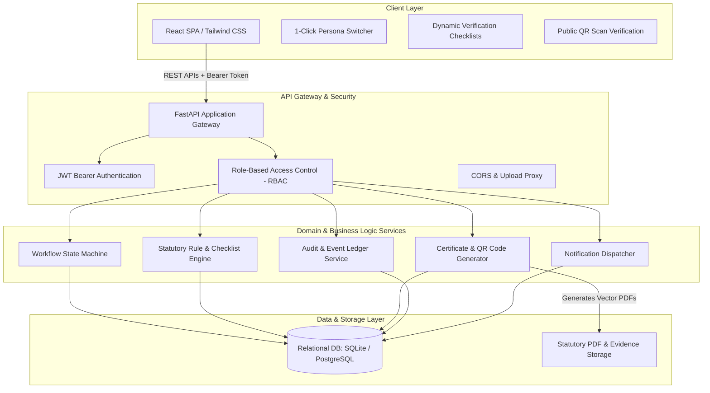
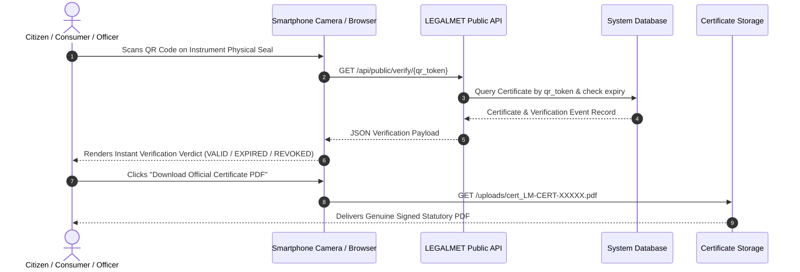

# METRION — Architecture & System Design

**SIH26036:** Development of an Online Verification System for Weighing and Measuring Instruments  
**Core Architectural Thesis:** *The Instrument is the Long-Lived Digital Entity.* Applications, schedules, assignments, and verification events represent transactional milestones across that instrument's statutory lifecycle.

---

## 1. System Overview

`METRION` is an enterprise-grade statutory verification management system designed for India's Legal Metrology ecosystem. It replaces legacy manual paper stamping and fragmented registry systems with a deterministic, auditable, and transparent digital workflow.

### Architectural Tenets
1. **Physical Grounding:** Verification is performed physically on-site by authorized human officials—Legal Metrology Officers (LMO) or Government Approved Test Centres (GATC). The system explicitly avoids fake AI-based physical verification claims.
2. **Deterministic Statutory Rules:** Instrument verification parameters, Maximum Permissible Error (MPE) thresholds, and calibration checklists are evaluated deterministically using versioned rule sets.
3. **Immutable Lifecycle Continuity:** Instruments maintain a persistent statutory identity (`LM-INST-XXXXXX`) across recurrent verification cycles over their entire multi-year operational lifetime.
4. **Cryptographic & QR Verifiability:** Certificates feature dynamic URL-encoded verification tokens with cryptographic hashes (`SHA-256`) that any citizen, field inspector, or enforcement squad can verify instantly without login credentials.

---

## 2. High-Level Component Architecture

---

## 3. Layered Design Breakdown

### 3.1 Client Layer (Frontend)
- **Framework:** React 19 + TypeScript + Vite.
- **Styling:** Tailwind CSS with a statutory institutional theme (Navy Blue `#0f172a`, Gold/Emerald Accents, Clean Data Tables).
- **Navigation:** Declarative routing (`react-router-dom` v7) with role-guarded route guards.
- **Persona Switcher:** An integrated, 1-click header switcher allowing hackathon evaluators to jump instantaneously between `Admin`, `Owner`, `LMO`, and `GATC` personas without logging out or losing workflow state.
- **Client Features:**
  - Dynamic form generation matching versioned statutory checklists.
  - Public Certificate verification view optimized for mobile camera QR scanning.
  - Interactive SVG lifecycle timelines tracking application milestones from `DRAFT` to `CERTIFICATE_ISSUED`.

### 3.2 API & Application Layer (Backend)
- **Runtime:** Python 3.11+ / FastAPI.
- **Design Pattern:** Service-Repository separation with strict domain models.
- **Key Modules:**
  - `workflow_engine.py`: Encapsulates all legal status transitions. Rejects invalid state transitions with descriptive HTTP 400 errors and records every transition in `StatusHistory`.
  - `rule_engine.py`: Dynamically fetches the active statutory checklist for a given instrument category and computes MPE compliance deterministically.
  - `certificate_service.py`: Generates standardized, vector-based Legal Metrology verification certificates using ReportLab, embedding high-resolution QR codes, security borders, and statutory disclaimers.
  - `audit_service.py`: Immutable event recording capturing actor IDs, timestamps, entity changes, and client IP references.

### 3.3 Data Layer
- **ORM:** SQLAlchemy 2.0 with type annotations and relationship cascade safety.
- **Portability:** Configured via `DATABASE_URL`. Zero-setup SQLite for rapid evaluation and local demos; PostgreSQL ready for cloud production deployments.

---

## 4. Hardware & Public Verification Interaction Flow

