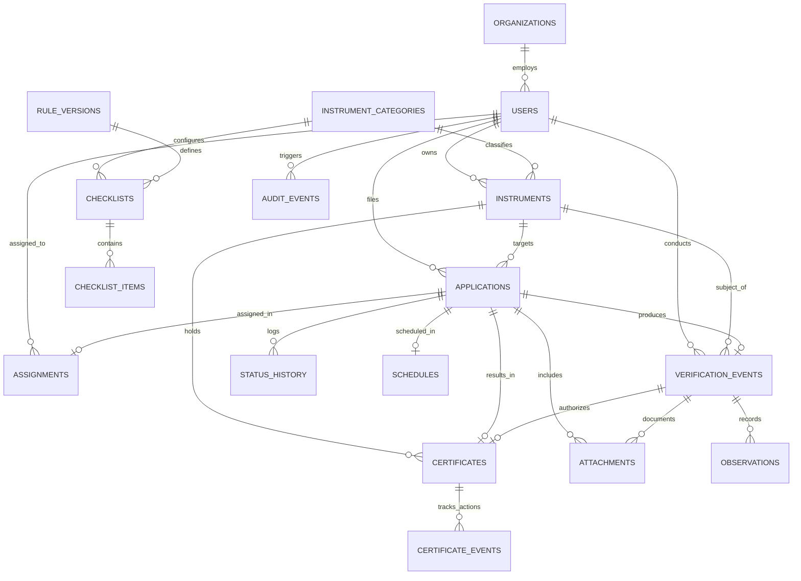

# METRION — Database Schema & Data Models

**SIH26036:** Development of an Online Verification System for Weighing and Measuring Instruments

---

## 1. Entity Relationship (ER) Diagram

---

## 2. Table Specifications

### 2.1 Core Identity & Master Data

#### `users`
Represents system actors across statutory roles.
- `id` (INTEGER, PK, Auto-increment)
- `email` (VARCHAR, Unique, Indexed) — User's identity and login.
- `hashed_password` (VARCHAR) — Secure bcrypt salted hash.
- `full_name` (VARCHAR) — Official legal name.
- `phone` (VARCHAR, Nullable) — Contact phone number.
- `role` (ENUM: `ADMIN`, `INSTRUMENT_OWNER`, `LMO`, `GATC`)
- `organization_id` (FK -> `organizations.id`, Nullable)
- `designation` (VARCHAR, Nullable) — Official title (e.g., Inspector, Senior Metrologist).
- `state` / `district` (VARCHAR) — Statutory administrative jurisdiction.
- `is_active` (BOOLEAN, Default: True)
- `created_at` / `updated_at` (DATETIME)

#### `organizations`
Commercial enterprises, weighbridge operators, or accredited test centers.
- `id` (INTEGER, PK)
- `name` (VARCHAR, Unique)
- `org_type` (VARCHAR: `OWNER_ENTERPRISE`, `GATC_AGENCY`, `GOVT_DIRECTORATE`)
- `registration_number` (VARCHAR, Unique)
- `gstin` (VARCHAR, Nullable)
- `address`, `state`, `district`, `pincode` (VARCHAR)

#### `instrument_categories`
Statutory definitions governed under Legal Metrology Rules (General) 2011.
- `id` (INTEGER, PK)
- `code` (VARCHAR, Unique) — E.g. `NWI_CLASS_III`, `WEIGHBRIDGE`, `FUEL_DISPENSER`.
- `name` (VARCHAR)
- `description` (TEXT)
- `default_validity_months` (INTEGER) — Statutory renewal period (e.g., 12 or 24 months).
- `is_active` (BOOLEAN)

---

### 2.2 Long-Lived Entity & Lifecycle

#### `instruments`
The core long-lived entity representing the physical machine.
- `id` (INTEGER, PK)
- `instrument_id` (VARCHAR, Unique, Indexed) — Persistent statutory token (e.g. `LM-INST-000001`).
- `category_id` (FK -> `instrument_categories.id`)
- `owner_id` (FK -> `users.id`)
- `organization_id` (FK -> `organizations.id`, Nullable)
- `manufacturer`, `model`, `serial_number` (VARCHAR)
- `capacity`, `accuracy_class` (VARCHAR) — Technical specifications.
- `year_of_manufacture` (INTEGER)
- `installation_address`, `state`, `district`, `pincode` (VARCHAR)
- `current_status` (VARCHAR) — `ACTIVE_COMPLIANT`, `PENDING_VERIFICATION`, `EXPIRED`, `REJECTED`.
- `active_certificate_id` (INTEGER, Nullable) — References currently valid certificate.
- `valid_until_date` (DATETIME, Nullable)

---

### 2.3 Transactional Workflows

#### `applications`
Verification requests submitted by owners.
- `id` (INTEGER, PK)
- `application_number` (VARCHAR, Unique, Indexed) — E.g. `APP-2026-000001`.
- `instrument_id` (FK -> `instruments.id`)
- `owner_id` (FK -> `users.id`)
- `application_type` (`NEW_VERIFICATION`, `RE_VERIFICATION`)
- `status` (ENUM: `DRAFT`, `SUBMITTED`, `UNDER_REVIEW`, `ACCEPTED`, `SCHEDULED`, `ASSIGNED`, `IN_FIELD_VERIFICATION`, `RESULT_SUBMITTED`, `VERIFIED`, `CERTIFICATE_ISSUED`, `REJECTED`, `EXPIRED`)
- `proposed_date` (DATETIME, Nullable)
- `remarks`, `review_notes` (TEXT, Nullable)

#### `status_history`
Immutable state change log for every application.
- `id` (INTEGER, PK)
- `application_id` (FK -> `applications.id`)
- `from_status` / `to_status` (VARCHAR)
- `changed_by_user_id` (FK -> `users.id`)
- `actor_role` (VARCHAR)
- `remarks` (TEXT, Nullable)
- `created_at` (DATETIME)

#### `schedules` & `assignments`
Field planning data structures linking applications to inspection dates and verifier personnel.
- `schedule`: `scheduled_date`, `time_window`, `location_address`, `contact_person`, `notes`.
- `assignment`: `assigned_to_type` (`OFFICER`, `GATC`), `assigned_to_user_id`, `assigned_by_user_id`, `status` (`ASSIGNED`, `IN_PROGRESS`, `COMPLETED`).

---

### 2.4 Legal Rules & Dynamic Checklists

#### `rule_versions` & `checklists`
Versioned compliance configurations preventing retroactive corruption.
- `rule_versions`: `rule_code`, `version_number`, `effective_from`, `effective_to`, `statutory_disclaimer`, `is_active`.
- `checklists`: `rule_version_id`, `category_id`, `name`, `description`.
- `checklist_items`: `checklist_id`, `order_index`, `code`, `label`, `field_type` (`BOOLEAN`, `NUMBER`, `TEXT`, `SELECT`), `unit`, `required`, `min_value`, `max_value`, `help_text`.

---

### 2.5 Verification & Output Artifacts

#### `verification_events` & `observations`
On-site empirical measurements recorded by the inspector.
- `verification_events`: `application_id`, `instrument_id`, `verifier_id`, `rule_version_id`, `verification_date`, `result` (`VERIFIED`, `REJECTED`, `INCONCLUSIVE`), `verifier_remarks`, `geo_latitude`, `geo_longitude`.
- `observations`: `verification_event_id`, `checklist_item_id`, `item_label`, `item_type`, `value_entered`, `unit`, `is_compliant`, `remarks`.

#### `certificates`
Statutory digital certificates generated for compliant instruments.
- `id` (INTEGER, PK)
- `certificate_number` (VARCHAR, Unique, Indexed) — E.g. `LM-CERT-2026-000001`.
- `qr_token` (VARCHAR, Unique, Indexed) — Cryptographically generated secure token embedded in QR URL.
- `instrument_id` (FK -> `instruments.id`)
- `application_id` (FK -> `applications.id`)
- `verification_event_id` (FK -> `verification_events.id`)
- `issuing_authority_name` (VARCHAR)
- `issue_date` / `valid_until_date` (DATETIME)
- `status` (`ISSUED`, `VALID`, `EXPIRED`, `REVOKED`)
- `pdf_path` (VARCHAR) — Path to vector PDF in storage.
- `security_hash` (VARCHAR) — SHA-256 integrity digest of certificate payload.
