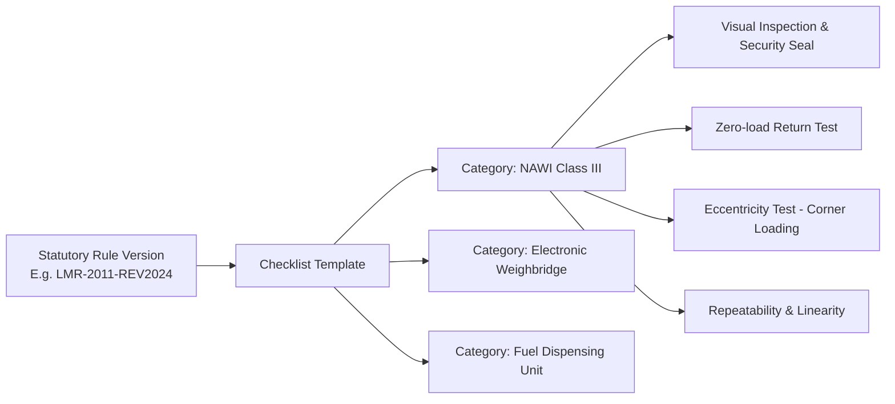

# METRION — Legal Rule & Checklist Configuration Engine

**SIH26036:** Development of an Online Verification System for Weighing and Measuring Instruments

---

## 1. Statutory Philosophy: Why Rule Engines, Not Fake AI

In statutory metrology, precision and deterministic law take absolute precedence over generative probabilistic heuristics:
- **No Machine Learning Hallucinations:** A computer vision or LLM algorithm cannot weigh a certified Class M1 20 kg standard weight or measure the internal friction in a weighbridge load cell.
- **Physical Verification Integrity:** Verification must be physically executed by human Legal Metrology Officers (LMOs) or Government Approved Test Centres (GATCs).
- **The Role of the Digital Engine:** The software acts as an **auditable statutory compliance co-pilot**:
  - Dynamically presents the statutory checklist for the specific instrument category and accuracy class.
  - Automatically calculates numerical tolerances and Maximum Permissible Error (MPE) thresholds.
  - Prevents an inspector from issuing a certificate if statutory thresholds are breached.
  - Generates immutable cryptographic records and vector PDFs.

---

## 2. Rule Architecture & Versioning



### 2.1 Immutability Through Rule Versions
Statutory rules change periodically (e.g., amendment gazettes to the Legal Metrology General Rules 2011). 
- When an amendment passes, an **Admin creates a new `RuleVersion`** (e.g., `LMR-2026-A1`) with an `effective_from` timestamp.
- Historic certificates remain linked to the exact `RuleVersion` active at the moment of inspection.
- Future inspections automatically pull the newest active version, preventing retroactive legal invalidation.

---

## 3. Seeded Categories & Sample Checklists

### 3.1 Non-Automatic Weighing Instruments (Class III)
Commonly used in retail stores, supermarkets, and wholesale mandis.

| Index | Code | Inspection Label | Type | Statutory Criteria / Bounds | Required |
|---|---|---|---|---|---|
| 1 | `NWI_VISUAL_01` | Physical condition, level bubble centered, legible markings | `SELECT` | `['PASSED', 'FAILED']` | Yes |
| 2 | `NWI_SEAL_01` | Lead/wire security seal intact and undamaged | `SELECT` | `['PASSED', 'FAILED']` | Yes |
| 3 | `NWI_ZERO_01` | Zero-setting accuracy and return to zero | `SELECT` | `['PASSED', 'FAILED']` | Yes |
| 4 | `NWI_ECCENTRICITY`| Eccentric loading error (1/3 Max Capacity on 4 corners) | `NUMBER` | Max: `1.0` g | Yes |
| 5 | `NWI_MPE_HALF` | Maximum Permissible Error at 50% rated capacity | `NUMBER` | Max: `0.5` g | Yes |
| 6 | `NWI_MPE_MAX` | Maximum Permissible Error at 100% rated capacity | `NUMBER` | Max: `1.0` g | Yes |

### 3.2 Electronic Road Weighbridges (60 Ton / 100 Ton)
Heavily utilized at port terminals, toll plazas, mining depots, and agricultural collection centers.

| Index | Code | Inspection Label | Type | Statutory Criteria / Bounds | Required |
|---|---|---|---|---|---|
| 1 | `WB_FOUNDATION` | Pit/pitless foundation drainage, clean gap, load cell seating | `SELECT` | `['PASSED', 'FAILED']` | Yes |
| 2 | `WB_LOADCELLS` | Hermetic sealing and load cell cable conduit integrity | `SELECT` | `['PASSED', 'FAILED']` | Yes |
| 3 | `WB_SECTION_TEST` | Sectional loading tolerance test across all pairs | `NUMBER` | Max: `20.0` kg | Yes |
| 4 | `WB_MPE_FULL` | Full capacity test with certified mobile test unit weights | `NUMBER` | Max: `30.0` kg | Yes |

---

## 4. Deterministic Rule Evaluation Logic

In `app/services/rule_engine.py`:

```python
def validate_observations(checklist: Checklist, observations: List[Dict]) -> Tuple[bool, List[str]]:
    """
    Validates submitted field observations against the checklist rules.
    Returns (all_compliant: bool, issues: List[str]).
    """
    issues = []
    obs_map = {obs["checklist_item_id"]: obs for obs in observations}

    for item in checklist.items:
        if item.required and item.id not in obs_map:
            issues.append(f"Missing mandatory observation: {item.label}")
            continue

        obs = obs_map.get(item.id)
        if not obs:
            continue

        # Check explicit compliance flag
        if not obs.get("is_compliant", True):
            issues.append(f"Item marked non-compliant: {item.label}")

        # Check numeric bounds (MPE)
        if item.field_type == "NUMBER" and item.max_value is not None:
            try:
                val = float(obs.get("value_entered", 0))
                if val > item.max_value:
                    issues.append(f"MPE exceeded for '{item.label}': {val} > max {item.max_value} {item.unit or ''}")
            except (ValueError, TypeError):
                issues.append(f"Invalid numeric value for '{item.label}'")

    return (len(issues) == 0, issues)
```

If `all_compliant` is `False`, the backend refuses to transition the application to `VERIFIED` and rejects the certificate issuance request with a transparent, itemized list of rule violations.
