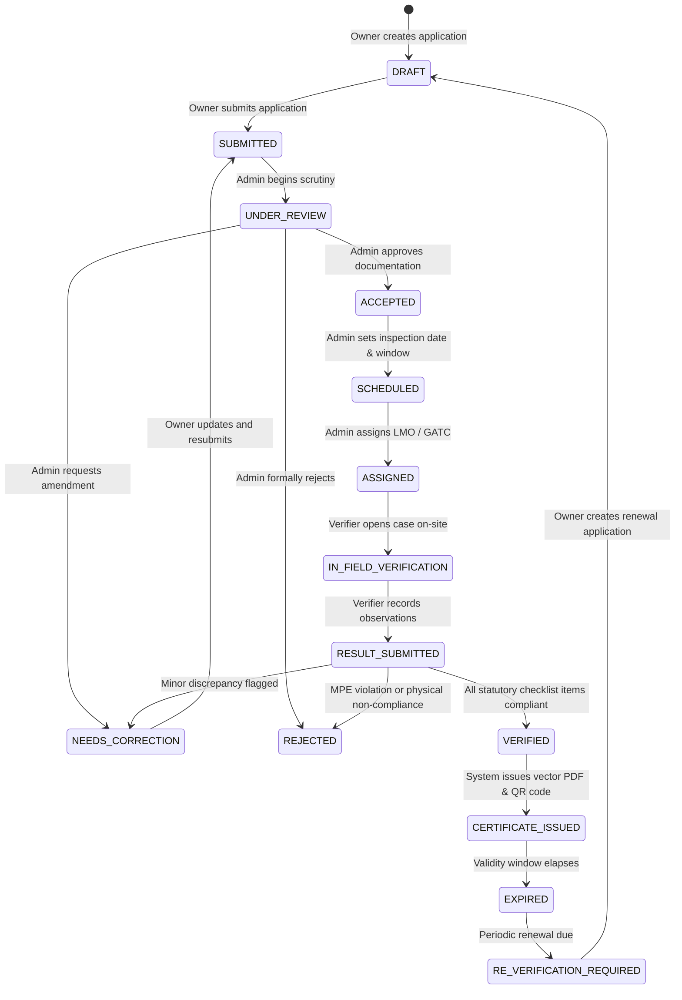

# METRION — Statutory Workflow & State Machine

**SIH26036:** Development of an Online Verification System for Weighing and Measuring Instruments

---

## 1. Statutory Lifecycle Philosophy

Under Indian Legal Metrology Regulations, verification is a strictly enforced legal procedure with clearly defined roles and liabilities:
- **Instrument Owner:** Legally liable for registering commercial instruments and applying for initial verification and mandatory periodic re-verification before certificate expiration.
- **Admin / Legal Metrology Directorate:** Responsible for application intake, jurisdiction management, scheduling field dates, and assigning qualified verifiers (LMO or GATC).
- **Legal Metrology Officer (LMO) / GATC:** Authorized physical inspector who travels to the site, tests the instrument with certified working standards, records quantitative observations, and makes the legal determination (`VERIFIED` vs `REJECTED`).
- **Certificate Checker / General Public:** Any citizen, merchant, or enforcement squad validating authenticity in the field.

---

## 2. State Machine Diagram

---

## 3. Detailed State Transition Matrix

| # | Current State | Allowed Next States | Permitted Roles | Actions & Side Effects |
|---|---|---|---|---|
| 1 | **DRAFT** | `SUBMITTED`, `CANCELLED` | `INSTRUMENT_OWNER` | Owner can edit instrument details, location, and proposed date. |
| 2 | **SUBMITTED** | `UNDER_REVIEW`, `CANCELLED` | `ADMIN` | Application is locked from owner edits. Admin receives task in Action Queue. |
| 3 | **UNDER_REVIEW** | `ACCEPTED`, `NEEDS_CORRECTION`, `REJECTED` | `ADMIN` | Admin reviews serial number, category standards, and premises address. |
| 4 | **NEEDS_CORRECTION** | `SUBMITTED`, `CANCELLED` | `INSTRUMENT_OWNER` | Owner receives alert and submits required corrections. |
| 5 | **ACCEPTED** | `SCHEDULED` | `ADMIN` | Inspection timetable and venue confirmed. |
| 6 | **SCHEDULED** | `ASSIGNED` | `ADMIN` | Officer (LMO) or Agency (GATC) selected based on jurisdiction and workload. |
| 7 | **ASSIGNED** | `IN_FIELD_VERIFICATION` | `LMO`, `GATC`, `ADMIN` | Verifier receives field order; status updates when case opened on-site. |
| 8 | **IN_FIELD_VERIFICATION**| `RESULT_SUBMITTED` | `LMO`, `GATC` | Quantitative observations and photo evidence uploaded. Rule engine validates compliance. |
| 9 | **RESULT_SUBMITTED** | `VERIFIED`, `REJECTED`, `NEEDS_CORRECTION` | `LMO`, `GATC`, `ADMIN` | Deterministic verification determination recorded. |
| 10| **VERIFIED** | `CERTIFICATE_ISSUED` | System / Verifier | Certificate generated with ReportLab, unique QR token assigned, validity date calculated. |
| 11| **CERTIFICATE_ISSUED**| `EXPIRED` | Scheduled Job / System | Instrument marked compliant; public verification active. Expiry triggers renewal notices. |

---

## 4. Re-Verification Lifecycle Loop

Under the Legal Metrology Act, weighing instruments must be verified at fixed intervals (typically 12 months for commercial electronic scales, 24 months for storage tanks or flow meters).

1. **Advance Warning (60 & 30 Days):** Automated alert notifications appear on the Owner Dashboard indicating imminent certificate expiration.
2. **Re-Verification Trigger:** Owner clicks **"Apply for Re-Verification"** directly on the instrument card.
3. **Historical Linkage:** A new application of type `RE_VERIFICATION` is spawned, automatically inheriting the persistent instrument ID (`LM-INST-XXXXXX`), category, model, and previous certificate history.
4. **Audit Trail Continuity:** Past certificates remain permanently archived and publicly verifiable as historical records, while the instrument transitions to the new active certificate upon passing field inspection.

---

## 5. Security & Rule Engine Enforcement

- **Guard against Invalid Transitions:** Attempting an invalid jump (e.g. `DRAFT` directly to `VERIFIED`) triggers a strict `HTTP 400 Bad Request` with an exact explanation of permitted transitions.
- **Rule Engine Validation:** A verifier cannot mark an instrument `VERIFIED` if any mandatory checklist item was flagged non-compliant or failed numerical Maximum Permissible Error (MPE) thresholds.
- **Immutable Status History:** Every transition inserts an auditable row in `StatusHistory` with the actor's ID, role, remarks, and a UTC timestamp.
